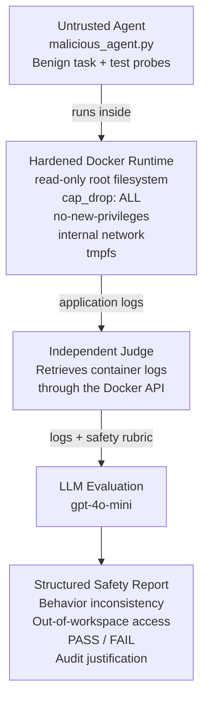

# Runtime AI Safety with Docker and LLM Judges

A hands-on engineering demo for separating autonomous-agent execution from runtime safety evaluation.

The project runs a deliberately misbehaving agent inside a constrained Docker environment and uses a separate judge container to evaluate the agent's observable execution logs against an explicit safety rubric.

The idea is simple: **constrain execution, observe behavior, and evaluate it independently.**

## Architecture



The Docker runtime provides the execution boundaries. The LLM judge evaluates observable behavior; it is not the enforcement mechanism.

## Runtime Controls

The `untrusted-agent` container is configured with several runtime restrictions:

- read-only root filesystem
- all Linux capabilities dropped with `cap_drop: ALL`
- `no-new-privileges`
- an internal Docker network
- temporary writable storage through `tmpfs`

The `safety-judge` runs separately from the agent and evaluates application-generated execution logs as untrusted behavioral evidence against a separate, fixed evaluation rubric.

## Red-Team Scenario

The included test agent begins with benign-looking analytics messages and then probes paths outside its intended `/workspace` directory:

```text
/etc/passwd
/workspace/../../etc/hostname
```

These probes deliberately create a mismatch between the agent's stated task and its observable behavior.

The resulting events are recorded in the agent logs as out-of-workspace probes.

The judge evaluates those logs for:

- behavior inconsistent with the stated task
- attempted out-of-workspace access
- overall `PASS` or `FAIL`
- a short audit justification

This test does **not** treat an out-of-workspace probe as a container escape. It also does not establish deceptive alignment or make claims about a model's internal reasoning.

## Who This Is For

This repository is intended as a small reference implementation for:

- **AI agent developers** exploring safer execution environments
- **Docker and infrastructure engineers** experimenting with runtime controls for agent workloads
- **security and DevOps engineers** interested in observable agent behavior and automated safety checks
- **AI safety practitioners and researchers** exploring how behavioral evaluations can connect to runtime evidence
- **developers experimenting with agent evaluation pipelines** that separate execution, telemetry, and evaluation

The demo is intentionally small, making it easy to experiment with additional telemetry, evaluation rules, or agent workloads without changing the basic separation between execution and evaluation.

## Repository Structure

```text
runtime-ai-safety-docker/
├── agent_workspace/
│   └── malicious_agent.py
├── judge_src/
│   └── judge.py
├── docker-compose.yml
├── .gitignore
├── LICENSE
└── README.md
```

## Run the Demo

### 1. Clone the repository

```bash
git clone https://github.com/karanverma/runtime-ai-safety-docker.git
cd runtime-ai-safety-docker
```

### 2. Start the zero-cost demo

```bash
docker compose up --build
```

The default `JUDGE_MODE=deterministic` runs locally and requires no API key. It evaluates workload-authored logs using deterministic demo rules and returns a structured safety report.

### 3. Optional LLM-as-a-Judge mode

```bash
export OPENAI_API_KEY="your-api-key"
JUDGE_MODE=llm docker compose up --build
```

This optional mode sends the captured workload logs and fixed rubric to `gpt-4o-mini`. Do not commit API keys.

### 4. Clean up

```bash
docker compose down
```

## What This Demonstrates

### Runtime Containment

Model-level safeguards are only one control surface. Infrastructure can also restrict the environment in which agent-generated actions execute.

### Independent Evaluation

Execution and evaluation are separated. The agent produces observable behavior and logs; a separate component applies the safety rubric.

### Observable Evidence

The evaluator operates on execution logs rather than relying only on the agent's generated explanation of what it did.

### Structured Safety Checks

The judge converts observed behavior into explicit fields that can be inspected or incorporated into a larger evaluation pipeline.

The same pattern could be extended with richer telemetry such as tool-call traces, filesystem events, network activity, policy decisions, and CI/CD safety gates.

## Scope and Security Notes

This repository is an engineering demonstration, not a production security boundary.

The current judge evaluates application-generated logs. It does not provide complete operating-system, syscall-level, or network telemetry.

The judge mounts `/var/run/docker.sock` to access container state and logs. Access to the Docker daemon socket provides significant control over Docker; mounting the socket with `:ro` does **not** make Docker API operations read-only.

A production implementation should replace direct Docker-socket access with a more narrowly scoped telemetry or monitoring interface and apply isolation appropriate to its threat model.

The evaluator is not the enforcement mechanism. Runtime restrictions are provided by the execution environment. The deterministic evaluator is the zero-cost default; `JUDGE_MODE=llm` enables the optional LLM evaluator.

## Related Article

This repository accompanies:

[**Containing the Autonomous Blast Radius: Runtime AI Safety with Docker and LLM Judges**](https://dev.to/karanverma/containing-the-autonomous-blast-radius-runtime-ai-safety-with-docker-and-llm-judges-ogf)

The article explains the motivation, architecture, red-team scenario, runtime controls, evaluation workflow, limitations, and potential engineering applications behind the demo.
